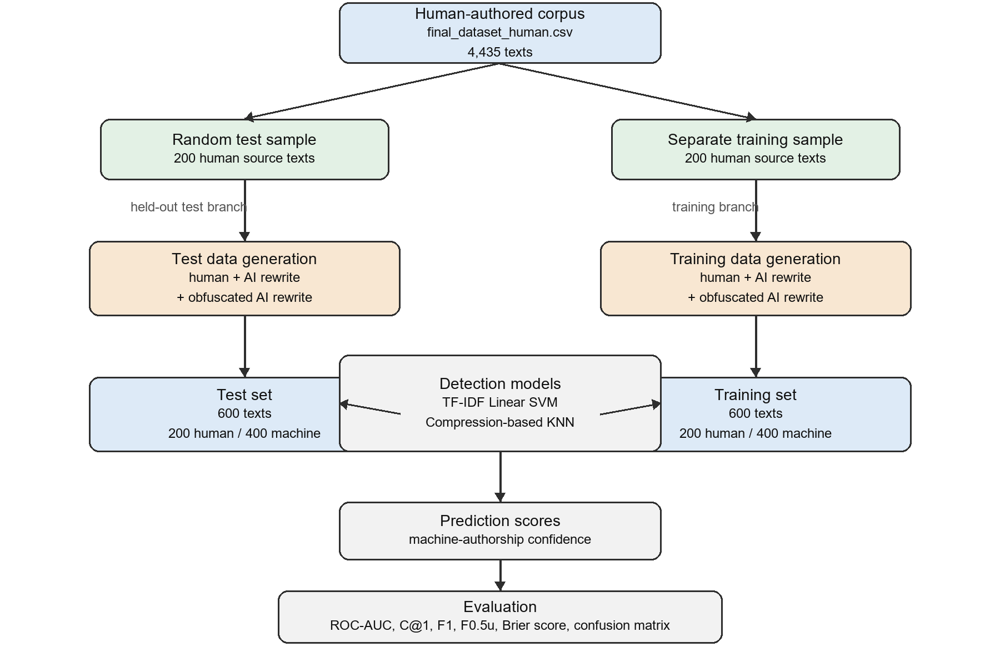

# PAN26 Generative AI Detection Assignment

This repository contains the code and experimental outputs for a course
assignment based on the PAN/CLEF 2026 Voight-Kampff Generative AI Detection
task. The goal is to distinguish human-authored text from machine-authored
text, including machine-authored text that has been deliberately obfuscated.

## Overview

The experiment follows the assignment requirement of constructing a custom
test set from a human-authored corpus:

- 200 original human-authored texts
- 200 non-obfuscated machine-generated rewrites
- 200 obfuscated machine-generated rewrites

The final experiment uses a local Ollama model, `qwen2.5:7b-instruct`, to
generate the machine-authored texts. Two detection baselines are evaluated:

- TF-IDF + Linear SVM
- Compression-based KNN using normalized compression distance with `zlib`

The experimental pipeline is summarized in:



## Repository Structure

```text
.
+-- README.md
+-- requirements.txt
+-- experimental_pipeline.png
+-- run_with_ollama.ps1
+-- run_with_api_key.ps1
+-- scripts/
|   +-- run_pipeline.py
|   +-- evaluate_predictions.py
+-- src/
|   +-- generation.py
|   +-- io_utils.py
|   +-- metrics.py
|   +-- models.py
|   +-- obfuscation.py
+-- outputs/
    +-- ollama_full/
        +-- test_dataset_600.jsonl
        +-- train_dataset.jsonl
        +-- predictions_tfidf_svm.jsonl
        +-- predictions_compression_knn.jsonl
        +-- metrics.json
        +-- results_summary.csv
        +-- selected_human_200.csv
```

## Data

The source human-authored corpus is expected as `final_dataset_human.csv`.
In the original experiment, this file was provided through the course Absalon
platform and contained 4,435 human-authored texts.

The scripts expect a CSV file with either a `text` column or a column named `0`.
The generated output files include the constructed train/test datasets and
prediction files.

## Setup

Install the Python dependencies:

```powershell
pip install -r requirements.txt
```

For the final local generation setup, install Ollama and pull the model:

```powershell
ollama pull qwen2.5:7b-instruct
```

Confirm that Ollama is running:

```powershell
ollama list
```

## Reproducing the Final Ollama Experiment

From the repository root, run:

```powershell
python scripts/run_pipeline.py `
  --provider ollama `
  --model qwen2.5:7b-instruct `
  --limit 200 `
  --train-human 200 `
  --human-csv "C:\path\to\final_dataset_human.csv" `
  --out-dir outputs\ollama_full
```

Alternatively, on Windows PowerShell:

```powershell
powershell -NoProfile -ExecutionPolicy Bypass -File .\run_with_ollama.ps1
```

The helper script first runs a small smoke test before asking whether to run
the full experiment.

## Output Format

Dataset rows are written as JSONL records:

```json
{"id":"test-human-0000","text":"...","label":0,"source_id":"3586","subset":"test","kind":"human","generator":"human","obfuscation":"none"}
```

Prediction files use PAN-style confidence scores:

```json
{"id":"test-human-0000","label":0.21}
```

In prediction files, `label` is a confidence score in `[0, 1]`; values above
`0.5` are interpreted as machine-authored.

## Final Results

The final results in `outputs/ollama_full/results_summary.csv` are:

| Model | ROC-AUC | Brier | C@1 | F1 | F0.5u | Mean | Confusion |
|---|---:|---:|---:|---:|---:|---:|---|
| TF-IDF SVM | 0.9858 | 0.9653 | 0.9617 | 0.9715 | 0.9665 | 0.9701 | `[[185, 15], [8, 392]]` |
| Compression KNN | 0.9960 | 0.9640 | 0.9583 | 0.9697 | 0.9524 | 0.9681 | `[[175, 25], [0, 400]]` |

The confusion matrix format is `[[TN, FP], [FN, TP]]`, where the positive
class is machine-authored text.

## Notes on Generation and Obfuscation

The non-obfuscated machine texts are rewrites of the selected human source
texts generated with `qwen2.5:7b-instruct` through Ollama.

The obfuscated machine texts use a modified generation prompt and an additional
surface-level transformation step. The transformations include small sentence
reordering, lexical substitutions, contraction changes, punctuation variation,
and short discourse markers. These changes are intended to preserve readability
while reducing simple machine-text cues.

## OpenAI-Compatible Option

The pipeline also supports OpenAI-compatible chat completion endpoints:

```powershell
$env:OPENAI_API_KEY="sk-..."
python scripts/run_pipeline.py `
  --provider openai `
  --model gpt-4o-mini `
  --human-csv "C:\path\to\final_dataset_human.csv"
```

The checked final results in this repository use the local Ollama provider, not
the OpenAI provider.
